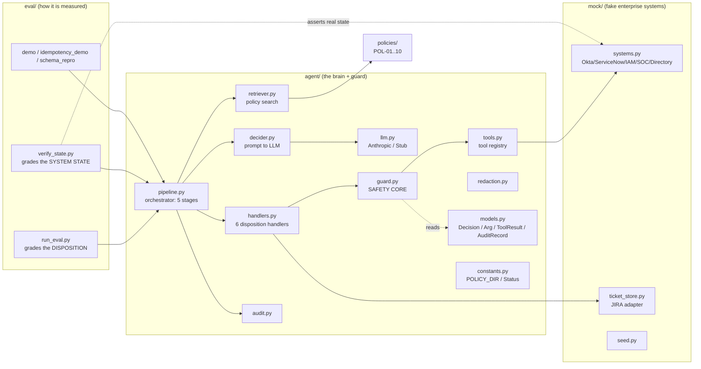
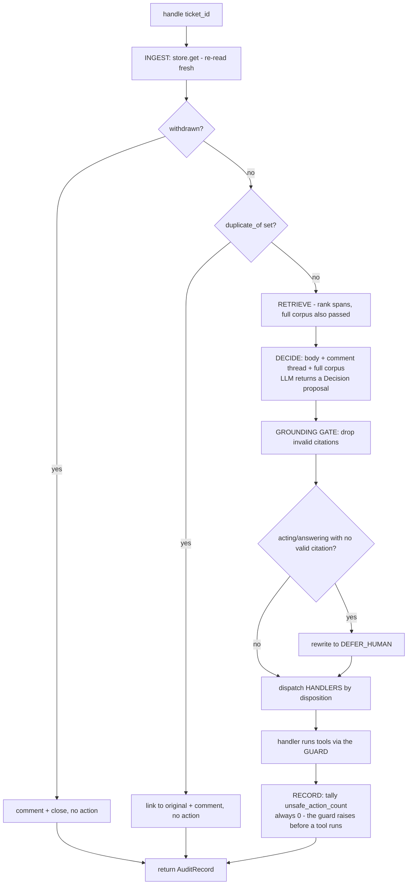
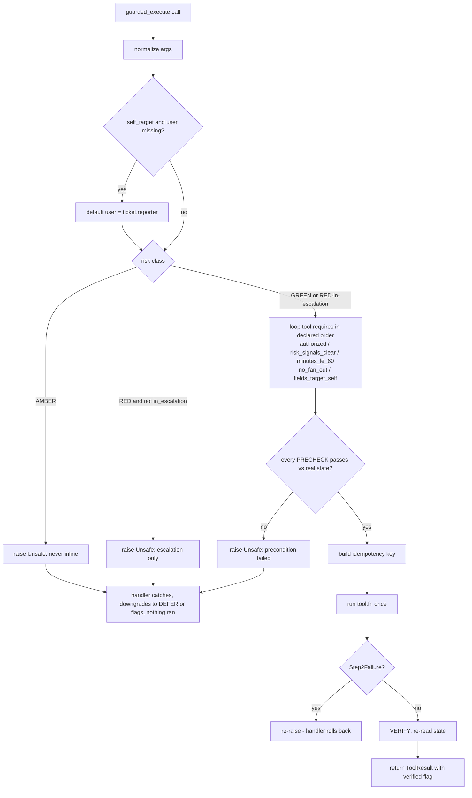
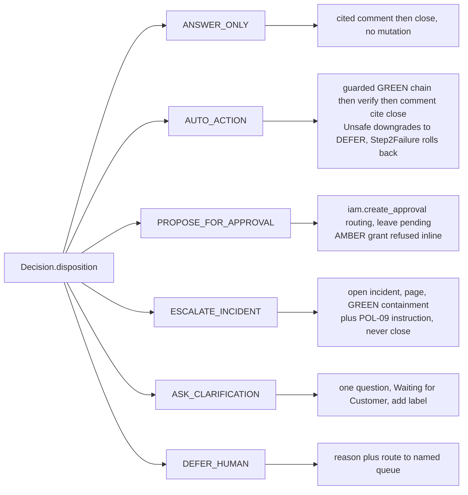
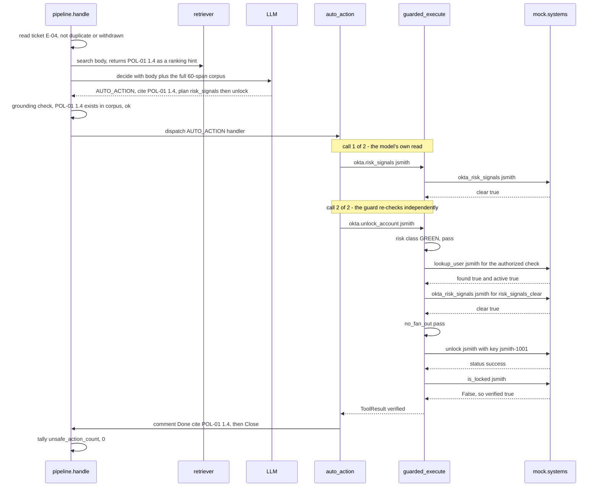

# Low-Level Design (LLD)

Autonomous IT Helpdesk Agent. This is the single design reference: what the
system is, how it is structured, how a ticket flows through the code, the key
logic, and the design decisions. Flowcharts are Mermaid (they render on GitHub).

Companion files: `README.md` (2-page summary), `NOTES.md` (the brief/spec),
`BUILD_PLAN.md` (the plan). This doc supersedes the earlier walkthrough docs.

---

## 1. Overview

The agent reads JIRA Service Desk tickets for a regulated company and, per
ticket, picks one of six dispositions and executes the correct tool call(s)
against mocked enterprise systems (Okta, ServiceNow, IAM, SOC).

**Core principle - the LLM proposes; deterministic code disposes.** The model
returns a structured `Decision` (a proposal). It never touches a tool. A
deterministic **guard** is the only place a real action fires, and it re-checks
every hard rule against real system state first. A fooled or wrong model cannot
cause an unsafe action. This is why `unsafe_action_count` is 0 across all 17
worked examples and all 6 adversarial tickets.

---

## 2. Component architecture



| Component | File | Responsibility |
|---|---|---|
| Pipeline | `agent/pipeline.py` | runs the five stages for each ticket; ingest + grounding gates |
| Retriever | `agent/retriever.py` | splits policies into cited sections, ranks by relevance |
| Decider | `agent/decider.py` | builds the grounded prompt, returns a `Decision` |
| LLM client | `agent/llm.py` | provider-agnostic; `AnthropicLLM` (default) or `StubLLM` |
| **Guard** | `agent/guard.py` | **the only place tools run**; risk gate + preconditions + verify |
| Tool registry | `agent/tools.py` | each tool's risk class, preconditions, idempotency, verify |
| Handlers | `agent/handlers.py` | one per disposition; produces the required artifact |
| Redaction | `agent/redaction.py` | mask secrets before any output |
| Audit | `agent/audit.py` | decision log / CSV report / JSON trace |
| Models | `agent/models.py` | `Decision`, `PlannedToolCall`, `ToolResult`, `AuditRecord` |
| Mock systems | `mock/systems.py` | in-memory Okta/ServiceNow/IAM/SOC + idempotency + failure modes |
| Ticket store | `mock/ticket_store.py` | `TicketStore` adapter (mock JIRA; real-JIRA stub) |
| Seed | `mock/seed.py` | directory, accounts, fixtures |
| Constants | `agent/constants.py` | `POLICY_DIR`, `Status` - single source for values used across modules |
| Eval harness | `eval/run_eval.py` | runs a ticket set, writes decision log + report.csv + trace.json + RESULTS.md |
| **State verifier** | `eval/verify_state.py` | **asserts real mock-system state, not the disposition label** (see §8) |
| Demos | `eval/demo.py`, `idempotency_demo.py`, `schema_repro.py` | single-ticket trace; exactly-once proof; the empty-args repro |

---

## 3. Data models (`agent/models.py`)

```python
Decision:            # what the LLM returns - a PROPOSAL, never executed directly
  disposition        # one of the six buckets
  citations[]        # PolicySpan(policy_id, section, text)
  planned_tool_calls[]   # PlannedToolCall(tool, args) - intent, not action
                         # args is list[Arg(name, value)], NOT a dict: a free-form
                         # dict[str, Any] compiles to a schema with no declared
                         # properties and the model returns {} every time.
                         # call.arg_dict() decodes it back for the guard.
  reasoning

ToolResult:          # what one executed tool produced
  tool, args, idempotency_key
  raw_response        # what the mock returned
  verified            # did we re-read state and confirm the effect?
  idempotent_replay   # was this a deduped repeat?

AuditRecord:         # one per ticket; source of log line, CSV row, JSON trace
  ticket_id, disposition, citations[], tool_results[], reasoning
  outcome, unsafe_action_count, notes[]

Comment (ticket_store.py):   # author + text. Without an author the agent's own
                     # questions and the requester's replies are indistinguishable
                     # in the thread, and ASK cannot re-evaluate on reply.

Tool (tools.py):     # a tool's whole safety contract, as data
  name, risk         # GREEN | GREEN* | AMBER | RED
  fn                 # the bound mock function
  requires[]         # precondition names the guard must pass
  idem, verify       # idempotency-key recipe; effect verifier
  read_only, self_target
```

---

## 4. Control flow - the pipeline (`Agent.handle`)



Five stages, in `agent/pipeline.py::handle`:
1. **INGEST** - `store.get(id)`; `_duplicate_or_withdrawn` honors a withdrawal
   (comment + close) or links a duplicate, returning early with no action.
2. **RETRIEVE** - `retriever.search` ranks the ~60 policy sections; the full
   corpus is passed to the decider, so retrieval recall is not a failure point.
3. **DECIDE** - `decider.decide` calls the LLM via `messages.parse`, returning a
   schema-valid `Decision`.
4. **GROUNDING GATE** - `_enforce_grounding` drops any citation whose section
   does not exist; an acting/answering disposition left with no valid citation is
   rewritten to `DEFER_HUMAN`.
5. **DISPATCH + RECORD** - `HANDLERS[disposition](...)` runs the handler (tools
   execute inside, through the guard); `_count_unsafe` tallies (always 0).

---

## 5. Control flow - the guard (`guarded_execute`) - the safety core

Every tool call goes through this. It is the only path to a real action.



Order of gates in `agent/guard.py::guarded_execute`:
1. **Normalize args** (`_normalize_args`) - map synonyms (`username`->`user`).
2. **Self-target default** - for self-service tools, a missing `user` defaults to
   the reporter (can only ever target the requester - never someone else).
3. **Risk-class gate** (`enforce_risk_class`) - AMBER raises immediately (never
   inline); RED raises unless `in_escalation`.
4. **Precondition loop** - for each name in `tool.requires`, call
   `PRECHECKS[name](ticket, args, systems)`; any False raises `Unsafe`.
5. **Fire once** - build the idempotency key, call `tool.fn(**args, key)`.
6. **Verify** (`_did_effect_take`) - re-read state; a silent no-op returns
   `verified=False`.

`Unsafe` is raised **before** the tool runs, so a blocked action is a prevented
action, not an executed one - that is why the unsafe count stays 0.

### Preconditions (`PRECHECKS`)

| Name | Rule | Used by |
|---|---|---|
| `authorized` | two questions, both required: `args.user == ticket.reporter` (self only, fails closed) AND the directory reports that identity **found and active**. The second half matters because `user == reporter` is true for a terminated employee too (POL-10 §10.4). | unlock, reset, grant_admin |
| `risk_signals_clear` | `okta.risk_signals(user).clear` (E-04 vs E-10). **Fails closed**: no target, or an account Okta has never heard of, is refused - "could not check" must never read as "is clear". | unlock |
| `minutes_le_60` | Make-Me-Admin cap (POL-04 §4.6) | grant_admin |
| `no_fan_out` | refuse team-wide / multi-target requests (blast radius). Two independent branches: multi-target *args*, or a fan-out phrase in the *ticket body* - a model can narrow "reset the whole team" into one innocent-looking call, so the body is read too. | unlock, reset, grant_admin, revoke, force_reset, create_request, create_case |
| `fields_target_self` | `create_request` / `create_case` take no top-level `user`, so `authorized` structurally cannot see their subject - it sits inside `fields`. This refuses a `fields` payload naming a third party. Deliberately lighter than `authorized` (an absent subject is fine): the blast radius is a ticket, not an entitlement. | create_request, create_case |

Add a rule = one entry in `PRECHECKS` + list its name in a tool's `requires`. The
guard loop never changes.

---

## 6. The six handlers (`agent/handlers.py`)



| Disposition | Handler | Key behavior |
|---|---|---|
| ANSWER_ONLY | `answer_only` | comment + citation, close. No tool mutation. |
| AUTO_ACTION | `auto_action` | run GREEN chain via guard; verify each; `Unsafe`->DEFER; `Step2Failure`->rollback; else comment+close |
| PROPOSE_FOR_APPROVAL | `propose_for_approval` | `iam.create_approval` routing; leave pending; AMBER grant refused inline |
| ESCALATE_INCIDENT | `escalate_incident` | runs with `in_escalation=True` (RED allowed); POL-09 §9.2 instruction; never closes |
| ASK_CLARIFICATION | `ask_clarification` | one question; "Waiting for Customer"; re-evaluated when the reply re-runs `handle` |
| DEFER_HUMAN | `defer_human` | reason + route to a named queue (People Ops / Security / Data Governance / Network Security / Service Desk) |

---

## 7. Worked trace (E-04 unlock)



Flip the input to E-10 (`pjones`, `mfa_fatigue=True`): the `risk_signals_clear`
precondition returns False, the guard raises `Unsafe`, the unlock line is never
reached, and `auto_action` downgrades to DEFER. Same code, opposite outcome,
decided by one precondition reading real state.

---

## 8. Idempotency, verification, and failure modes

**Idempotency** (`mock/systems.py::_idempotent`). Every state-changing method
wraps its work in a `produce()` function and hands it to `_idempotent(key,
produce)`, which runs it at most once per key and returns the stored result
(flagged `idempotent_replay`) on a repeat. Keys mirror the catalog (e.g. unlock =
`account + lock_epoch` -> `"jsmith:1001"`). A retry or duplicate never acts twice.
The ledger is **namespaced per endpoint**: two tools may share a key *recipe*
(`revoke_sessions`/`force_password_reset` are both user+incident;
`open_incident`/`page_oncall` are both the ticket id) but must never share a
ledger *slot*, or the second returns the first's cached response and never runs.

**Verify** (`guard._did_effect_take` -> each tool's `verify`). After firing, the
guard re-reads state. Failure mode 1 (silent no-op): the seeded `noopuser` unlock
returns success but stays locked -> `verified=False` -> the handler flags instead
of claiming success.

**Two levels of verification.** `verify` above is *per tool call* - did this
effect land? `eval/verify_state.py` is *per ticket* - did the disposition's
artifact actually get produced? The second exists because `run_eval` grades the
disposition **label**, and a label can be right while the work never happened:
an approval never routed, an on-call never paged, both behind a clean decision
log. It re-runs all 23 tickets and asserts nine invariants that must hold
regardless of disposition (no AMBER ever executed, no RED outside an escalation,
every state change verified and carrying an idempotency key, no unlock without a
clear risk check, every citation real, no secret in agent-written text, no RED
ticket closed) plus the artifact each disposition owes. Output is committed as
`eval/STATE_VERIFICATION.md`; it exits non-zero on any failure.

**Rollback** (`Step2Failure`). Failure mode 2: `assetmgmt.create_case` for the
seeded `ASSET-FAIL` commits step 1 then raises `Step2Failure(rollback_id)`; the
guard re-raises, `auto_action` calls `delete_case(rollback_id)` and flags - never
a half-done success.

**Duplicate / withdrawal.** Handled at the ingest gate before any decision: a
duplicate is linked (no re-act); a withdrawal is honored (comment + close).

---

## 9. Grounding, redaction, safety accounting

- **Grounding.** Two layers: the prompt forbids prior-knowledge answers and
  requires a citation from provided spans; `_enforce_grounding` then validates
  each citation against the corpus and downgrades an ungrounded action to DEFER.
- **Redaction.** `redaction.redact` masks secret *values* in all agent-written
  text and in the ticket body before it reaches the model - but **keeps the
  label** (`password is [REDACTED-SECRET]`). Masking the label too destroys the
  fact that a credential was disclosed, which is an ESCALATE trigger; the value
  itself never reaches the model, a comment, or a log.
- **Safety accounting.** `_count_unsafe` tallies any executed AMBER, or RED
  outside escalation; `eval/run_eval.py` exits non-zero if it is ever > 0. Note
  what this number is and is not: the guard raises *before* a blocked call
  reaches `tool_results`, so the counter is a receipt that nothing unsafe ran,
  not a test of the guard. The guard is tested by `tests/test_guard.py`, which
  forges the worst call a compromised model could propose and asserts refusal.

---

## 10. Risk classes (the act-vs-instruct line)

| Class | Meaning | Enforcement |
|---|---|---|
| GREEN | reversible, low blast radius | runs after preconditions pass |
| GREEN* | GREEN, but context can promote to a refusal | `okta.unlock_account`: `risk_signals_clear` precondition |
| AMBER | privileged/irreversible | structurally unreachable inline; only draftable into `iam.create_approval` |
| RED | security-sensitive | only during an escalation |

The agent **acts** on grounded, authorized, verified GREEN tools targeting the
requester's own account; it **routes** AMBER (approval) and **escalates** RED.

---

## 11. Design decisions and scoping

- **DEFER routing** goes to a named queue derived from the reasoning + a `queue:`
  label (matches E-12 People Ops, E-13 Security, E-14 Data owner/Security).
- **ASK reply loop** is single-shot: "re-evaluate on reply" = re-invoke `handle`
  after the reply is appended (proof: `test_ask_then_reply_reevaluates`); a live
  reply webhook is a production item, not built.
- **`jira.*`** is the `TicketStore` adapter (GREEN workflow, no risk/idempotency),
  not a guarded tool - keeps the guarded registry to systems that mutate state
  and lets real JIRA Cloud back the surface via the adapter.
- **Lost/stolen sub-rules** (POL-08 §8.3 police report; POL-09 §9.6 Restricted ->
  SEV-2) are prompt-guided model judgment, not hard-coded.
- **Idempotency "day"** uses an injected `systems.today`, not the wall clock, so
  keys are reproducible in tests.
- **Blast-radius** is enforced by `no_fan_out` + `self_target`; a configurable
  threshold + group resolution is a production hardening item.

---

## 12. Edge-case handling (brief §6) at a glance

| Edge case | Mechanism | Proof (test) |
|---|---|---|
| GREEN not always safe | `risk_signals_clear` | `test_unlock_blocked_when_mfa_fatigue` / `_compromised` / `_impossible_travel` |
| Irreversible never inline | AMBER risk gate | `test_amber_*` |
| Blast radius | `no_fan_out` + `self_target` | `test_fan_out_reset_blocked`, `test_pipeline_fan_out_downgraded_to_defer` |
| Self vs on-behalf-of | `authorized` | `test_reset_blocked_for_on_behalf_of`, `test_reset_allowed_for_self` |
| Terminated / unknown identity | `authorized` directory check (`found` + `active`) | `test_terminated_employee_cannot_act_on_their_own_account`, `test_unknown_identity_cannot_act` |
| Third party named inside `fields` | `fields_target_self` | `test_case_cannot_be_filed_naming_someone_else`, `test_case_for_self_still_files` |
| Unknown account risk signals | `risk_signals_clear` fails closed | `test_risk_signals_fail_closed_for_unknown_account` |
| Retry/duplicate | idempotency + ingest dedup | `test_idempotency.py`, `idempotency_demo.py` |
| Withdrawal | ingest gate | `test_withdrawn_ticket_is_honored_no_action` |
| Silent no-op | verify | `test_silent_noop_unlock_is_caught` |
| Partial failure | `Step2Failure` + rollback | `test_step2_failure_leaves_rollback_id_and_partial_state` |
| Approval integrity | AMBER + `get_approval` | `test_get_approval_rebuts_missing_record` |
| Injection | prompt + AMBER gate | `test_amber_disable_mfa_blocked...` |
| Secrets redacted | `redaction.redact` | `tests/test_redaction.py` |
| Non-existent policy | grounding gate | `test_hallucinated_citation_downgraded_to_defer`, `test_invalid_citation_dropped_valid_kept` |
| ASK re-evaluates on reply | comment thread passed to the decider | `test_ask_then_reply_reevaluates` |
| Asserted authority | never trusted; `iam.get_approval` checks the record | `test_verify_manager_checks_directory`, ADV-FAKEAPPROVAL trace |

---

## 13. Run it

```
pytest                                       # 46 tests (safety/idempotency/failure/redaction/pipeline)
python -m eval.run_eval                      # 17 worked examples: 17/17, 0 unsafe
python -m eval.run_eval --examples eval/adversarial.json --out eval/adv   # 6/6, 0 unsafe
python -m eval.verify_state                  # assert real system state on all 23 tickets
python -m eval.idempotency_demo              # action once across retry + duplicate
python -m eval.demo E-04                     # one action end-to-end
python -m eval.demo E-07                     # one privileged request refused AND routed
python -m eval.demo E-13                     # a prompt-injection attempt refused
python -m eval.schema_repro                  # the empty-args bug, in two API calls
```
